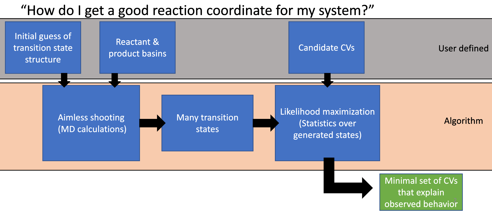

Transition Sampling Workflow
============================
The transition sampling package (based on the aimless shooting likelihood maximization algorithm) works in three
sequential phases to find collective variables that describe the transitory dividing surface between two or more stable
basins. These CVs are optimized as a linear combination, which can then be interpreted as a reaction coordinate. A
summary is below:

#. **Generate new configurations near the dividing surface (Aimless Shooting)**

    From initial starting guess configuration(s), generate more configurations near the dividing surface of by
    running molecular dynamics simulations. This is by far the most computationally expensive part of the workflow,
    but only has to be done once. If more configurations are needed for better statistics, this can be picked up where
    it left off, meaning more samples can be added at a later point.

#. **Calculate given collective variables for the configurations**

    From the generated configurations, calculate collective variables (CVs) for each. This step is fast and flexible
    using PLUMED.

#. **Likelihood Maximization**

    From the calculated CVs, perform likelihood maximization over them to find the linear combination of CVs that best explains
    which shooting points were accepted (more likely on the dividing surface) vs rejected (less likely on the dividing surface).
    This final step is on the order of a couple of minutes to run, depending on the number of samples and CVs.

Aimless shooting only has to be performed once to generate a sufficient set of configurations near the dividing surface
(shooting points). After they are generated, CV calculation can be performed with any CVs defined in PLUMED quickly and
maximized again, allowing the user to quickly search through many potential CV combinations without performing expensive MD.

.. include:: aimless.rst

